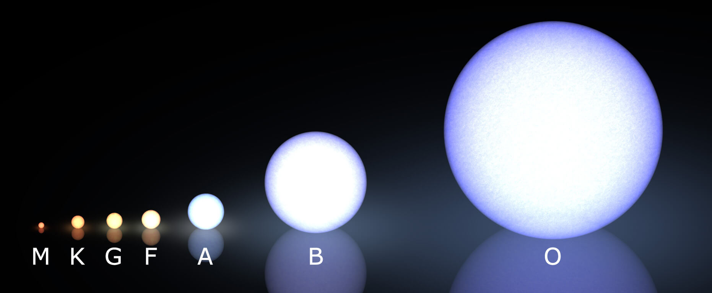

## **Introducción**

El estudio de las estrellas ha sido una fascinación constante para la humanidad a lo largo de la historia. La astronomía moderna ha avanzado enormemente en nuestra comprensión de estas entidades celestiales, gracias en gran parte al análisis de datos recopilados de observaciones astronómicas. En este trabajo, nos centraremos en el análisis de un conjunto de datos que contiene información sobre estrellas.

Este análisis no solo nos permitirá comprender mejor las propiedades intrínsecas de las estrellas, sino que también puede tener aplicaciones prácticas en campos como la astrofísica y la cosmología. Por ejemplo, comprender las relaciones entre la masa, el radio y la temperatura efectiva de las estrellas puede ayudarnos a clasificarlas y comprender mejor su evolución y comportamiento.

La clasificación espectral de las estrellas es un sistema utilizado por los astrónomos para categorizar y organizar las estrellas en función de las características de su luz. La luz que emite una estrella contiene información crucial sobre su composición química, temperatura y otros aspectos importantes de su naturaleza.

Cuando observamos la luz de una estrella a través de un prisma o un espectrógrafo, vemos un espectro de colores con líneas y bandas oscuras y brillantes en diferentes partes del espectro. Estas líneas y bandas son características de los elementos químicos presentes en la atmósfera de la estrella y nos proporcionan información sobre su temperatura y otras propiedades.

La mayoría de las estrellas están actualmente clasificadas bajo el sistema de Morgan–Keenan (MK) que utiliza una letra y un número para designar cada tipo de estrella. Las letras van de O a M, siendo O las estrellas más calientes y M las más frías. Dentro de cada letra, hay subcategorías numéricas que indican con más detalle las características espectrales de la estrella. Además, en el sistema MK, se añade una clase de luminosidad a la clase espectral usando números romanos.

 

Por ejemplo, una estrella de tipo espectral "O" es muy caliente y brillante, con un espectro dominado por líneas de hidrógeno ionizado y helio. Por otro lado, una estrella de tipo espectral "M" es más fría y tenue, con líneas de elementos como el calcio y el magnesio en su espectro.

En resumen, la clasificación espectral de las estrellas es un sistema que nos permite organizar y entender mejor la diversidad de las estrellas en el universo, basándonos en las características de su luz y su composición química.

Los objetivos que se plantean en este trabajo son los siguientes:

* Utilizar modelos de clasificación para predecir el tipo espectral principal de las estrellas basándonos en sus características como masa, radio y temperatura efectiva.

* Evaluar y comparar el rendimiento de varios clasificadores en términos de precisión para determinar el modelo más efectivo en la clasificación espectral.

* Aplicar técnicas de regresión para predecir el número dentro del tipo espectral de las estrellas utilizando otras características como entrada.

* Evaluar la precisión de los modelos de regresión mediante métricas como el error cuadrático medio (MSE) o el coeficiente de determinación (R^2) y comparar su desempeño para identificar el modelo más adecuado para la variable a predecir.

El dataset se ha obtenido de NASA Exoplanet Archive, se trata de un conjunto de datos que la comunidad de exoplanetas ha recopilado en varias listas de posibles objetivos para futuras misiones de imagen directa de exoplanetas.

Enlace: https://exoplanetarchive.ipac.caltech.edu/cgi-bin/TblView/nph-tblView?app=ExoTbls&config=mission_exocat

